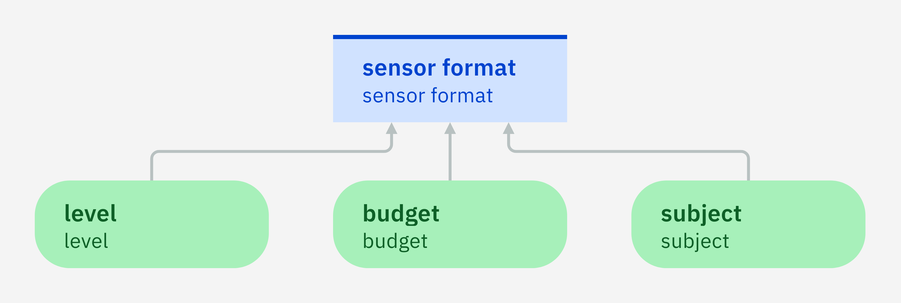

### Making decisions for a population of cases

Well even if the customer has ranked the sensor formats in a certain
way, this does not mean that the customer will end up buying a full-frame camera
even if this is the best choice in the ranking. Indeed, the best choice may
not be feasible in all cases. For example, a full-frame camera may turn
out to be too heavy for the customer when doing landscape
photography. And it may be simply out of budget. The customer will
need to determine which alternatives are feasible and then choose
the best camera among this reduced set of alternatives.

A particular customer needs to do this feasibility consideration only
once. However, now consider a whole population of customers. Let us
assume that they all rank the three sensor formats in the same way as
before, but that they have different characteristics and end up with different 
sets of feasible sensor formats. There may be customers having a low, a medium, or a high
budget, There may be customers that want to do landscape photography,
others want to do portraits, even others want to do night photography
and so on. Furthermore, there may be beginners, advanced photographers, 
and professionals. All these factors determine the feasibility of the
alternatives.

The available alternatives will thus depend on the particular
case. There are cases where the best alternative is no longer possible
and the second best or third best choice needs to be made. The problem
now consists in recommending the best feasible sensor format depending
on the given case. An analyst may enumerate all the possible cases,
determine the feasible alternatives for each of these cases, and
retain the best choice for each case. 

#### Exercise 1

Create a spreadsheet with columns for characteristics such as

 - Budget: low, medium, high.
 - Subject: landscape, portrait, sports.
 - Level: beginner, professional.
 
Add rows for all the 18 combinations. Each row thus describes a
possible case.
 
Add a column for each sensor format indicating whether this sensor format is feasible for the given case. 
The following constraints are used here for the sake of the exercise:

 - Low budget eliminates APS-C and full-frame cameras.
 - Medium budget eliminates full-frame cameras.
 - Sports photography eliminates Micro-Four Third cameras.
 - Landscape photography eliminates full-frame cameras.
 - Beginner level eliminates full-frame cameras.

Add a column that shows the best decision for each
case. Use the ranking from [Step 1](../step1/description.md)
to determine which is the best decision among those sensor formats that are feasible.
If all sensor formats are infeasible for a case, just indicate that there is no
recommendation for that case.

For example, the following row describes a beginner who has a medium
budget and is interested in landscape photography. APS-C camera
and a Micro-Four Third camera are feasible alternatives in this case,
but a full-frame camera is not. This eliminates the best choice in the
given ranking, meaning that the decision will be the second choice,
namely an APS-C camera.

| Level    | Subject   | Budget | Full-Frame | APS-C    | Micro-Fourth Third | Decision |
| -------- | --------- | ------ | ---------- | -------- | ------------------ | -------- |
| beginner | landscape | medium | infeasible | feasible | feasible           | APS-C    |
| ...      | ...       | ...    | ...        | ...      | ...                | ...      |

#### Exercise 2

Define an ADS decision table that directly maps each case to a decision:

 - Create a data model with enumeration types for budget, subject,
   level, and sensor format.
 - Create a decision model with three input data nodes for budget,
   subject, and level and a decision node for sensor format.
 - Ensure that the decision node depends on the three input data nodes as indicated by the diagram.
 

 - Add a decision table to the decision node that has columns for all input data nodes.
 - Fill in the rows according to the spreadsheet. 
 
For example, the following row describes a beginner who has a medium
budget and is interested in landscape photography. An APS-C camera is
recommended in this case:
 

 

#### Lessons learned

Unlike the spreadsheet, the decision table will not have columns
showing the feasible sensor formats. This kind of information is
needed when finding out which are the best decisions for the given
cases. However, it is no longer needed when defining a
decision service which simply outputs the best decision of a case when
this case is given as input. 

The ranking determined in Step 1 does not appear in the decision table either.
However, it allowed us to identify the best decision for each case and thus
ensures that the decision logic is consistent with respect to this ranking.

Decision tables should not be confused with consequence tables which are used to 
evaluate the alternatives according to different criteria (see [Step 1](../step1/description.md)).
As illustrated above, a decision table provides a short-cut for determining the
best feasible alternative for a given case. It thus refers to information that constrains 
the set of alternatives, whereas a consequence table refers to the consequences of 
the alternatives. 

#### Limitations

This approach is well-suited if the number of cases is relatively
small. Filling out a row for each case is quite laborious. The [next step](quiz/quiz.md)
will examine how this can be improved.

[Back to ADS concepts step by step](../README.md)

