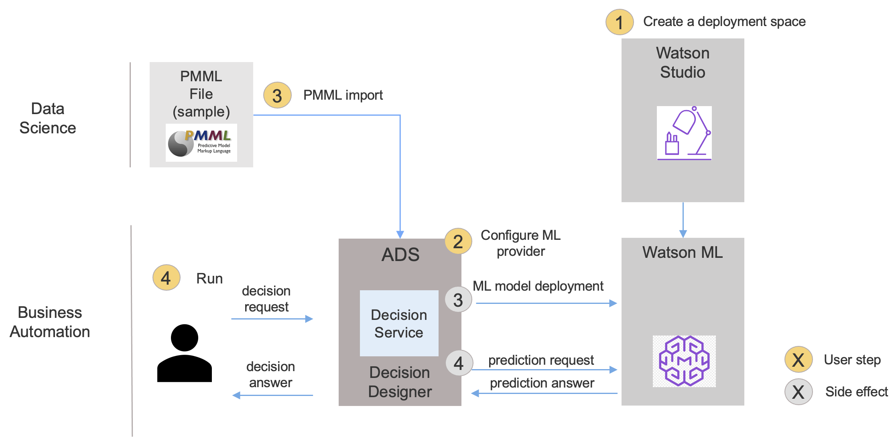
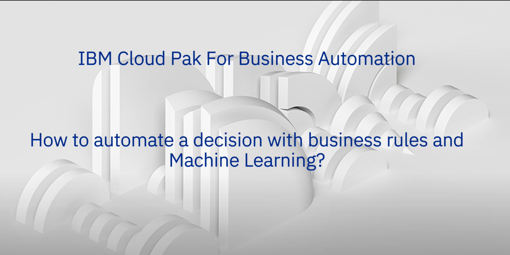

# Short Tutorial: Using machine learning to make better decisions

## Description


This tutorial shows you how to connect an existing predictive model to a Watson Machine Learning model and use it in a decision service that validates loans. The decision service uses a decision model to apply policies and incorporate a risk prediction. These tutorial tasks are illustrated in the following diagram.



For more information on decision models and predictive models, see `Modeling decisions`[](https://www.ibm.com/docs/en/cloud-paks/cp-biz-automation/23.0.2?topic=services-developing-decision)[](https://www.ibm.com/docs/en/ads/23.0.2?topic=services-developing-decision) and `Integrating machine learning`[](https://www.ibm.com/docs/en/cloud-paks/cp-biz-automation/23.0.2?topic=artifacts-integrating-machine-learning)[](https://www.ibm.com/docs/en/ads/23.0.2?topic=artifacts-integrating-machine-learning).

For more tutorials about machine learning in Automation Decision Services see:
   - [Machine learning quick tutorial](../MachineLearningQuickTutorial/README.md) to learn how to connect a predictive model to a Watson Machine Learning Model. 
   - [Machine learning complete tutorial](../MachineLearningCompleteTutorial/README.md) to learn how to create predictive model, connect it to a Watson Machine Learning Model, deploy and execute the decision.
   - [Machine learning customer loyalty sample](../MachineLearningCustomerLoyaltySample/README.md) to get another example using two predictive models.
 
## Learning objectives
   - Create an empty deployment space in Watson Studio.
   - Create a WML provider in Decision Designer.
   - Upload a PMML model directly in Decision Designer and connect it to an existing predictive model
   - Run a decision model using this predictive model.

## Audience

This sample is for technical and business users who want to apply predictive analytics through machine learning in decision services in Automation Decision Services. It also shows data scientists and data engineers how Automation Decision Services can be used to apply machine learning models in decision-making applications.

## Time required

15 minutes

## Prerequisites

Prepare with the following resources:
- `Getting started in Automation Decision Services`[](https://www.ibm.com/docs/en/cloud-paks/cp-biz-automation/23.0.2?topic=resources-getting-started)[](https://www.ibm.com/docs/en/ads/23.0.2?topic=resources-getting-started): This tutorial introduces you to Automation Decision Services.
- [Watson Machine Learning](https://dataplatform.cloud.ibm.com/docs/content/wsj/analyze-data/ml-overview.html?audience=wdp&context=wdp): This service lets you build analytical models and neural networks for use in applications. 

You must have the following environments:
- **Decision Designer**: A web-based user interface for developing decision services. You work with the sample decision service by importing it into a project and opening it in Decision Designer.
- **Watson Studio**: A web-based user interface for developing and deploying machine learning models. 

In this tutorial, you...
- Create an empty deployment space in Watson Studio.
- Define a machine learning provider using Watson Machine Learning.
- Upload a machine learning model by uploading a PMML file. 
- Connect a predictive model to a machine learning model deployed in Watson Machine Learning.
- Run a decision model using this predictive model.

Click the following image to watch a video that covers this tutorial:

[](https://www.youtube.com/watch?v=qPXmrsswfKY&ab_channel=IBMSupportandTraining)


# Task 1: Creating a deployment space in Watson Studio.

**About this task**

In this task, you...
- create an empty deployment space in Watson Studio

**Procedure**
1. You create a deployment space in Watson Studio following the WS [documentation](https://dataplatform.cloud.ibm.com/docs/content/wsj/analyze-data/ml-spaces_local.html?context=cpdaas&audience=wdp).
2. You get the data from Watson Studio that is required to define a machine learning provider in your decision project in Task 2. You need:
* the space id which is defined in the deployment space settings.
* the base URL of the Watson Machine Learning API endpoint. For instance `https://<location>.ml.cloud.ibm.com/ml/v4`.
* the authentication URL. For instance `https://iam.bluemix.net/identity/token`.

You also require an API key that you take from your [cloud account](https://cloud.ibm.com/iam/apikeys).

# Task 2: Defining a machine learning provider in Decision Designer

**About this task**

In this task, you...
- Import and explore a sample decision service.
- Define a machine learning provider using Watson Machine Learning.

## Step 1: Importing the sample decision service in Decision Designer

You import a sample decision service into a project. This decision service applies several criteria in determining a borrower’s eligibility for a loan.
One of the key factors is risk which is predicted by the machine learning model.

**Procedure**

1. Use the credentials provided for your instance to sign in to Decision Designer.
2. Create a new project and import the `Machine learning short tutorial - Loan approval` sample from the list of Discovery tutorials.
3. Click `Short machine learning loan approval` to open the decision service.

**Discovery**

Take a moment to look at the imported decision service.

1. Open the `Loan Validation Data` data model in the `Data` tab to browse the defined types. <br>
   The `risk probabilities` type is used by the predictive model.
2. Click `Short machine learning loan approval` in the breadcrumbs and open the decision model `Loan Validation Decision Model`: it decides if a loan can be given to a borrower. One of the key decision is the risk computed in the `Risk Score` node. It takes as input a prediction node corresponding to the `loan risk score` predictive model. The project may be in error, these errors will be fixed in Task 4.
3. Click `Short machine learning loan approval` in the breadcrumbs and open the predictive model `loan risk score`. It is not yet connected, you'll connect it in next steps.
4. Click on the `Input mapping` node and look at the input mapping rule: it defines the machine learning model input from a loan and a borrower.
5. Click on the `Output mapping` node and look at the output mapping rule: it defines a risk probability from the output of the machine learning model.

Next you will define a machine learning provider to connect the predictive model.

## Step 2: Defining a machine learning provider 

You create a machine learning provider to get your model deployment into your decision project. See `Managing machine learning providers`[](https://www.ibm.com/docs/en/cloud-paks/cp-biz-automation/23.0.2?topic=learning-managing-local-machine-providers)[](https://www.ibm.com/docs/en/ads/23.0.2?topic=learning-managing-local-machine-providers) for more information.

**Procedure**

1. Go back to the diagram and click in the diagram outside any node or link.
2. Click on the **Configure** button. Keep **Remote Machine Learning Model** selected. 
3. Click **Next** to select a provider. You see that no provider is defined. 
4. Click on **New provider** to define one. 
5. Click on **New +** to open the Machine Learning provider wizard:
   * Keep `Watson ML` as the type.
   * Set `wml-short` as the name.
   * Enter the description: `Provider for the machine learning short tutorial`.
   * Enter the following service credentials you get in Task 1 from Watson Studio to authenticate with your Watson Machine Learning service instance:
       * API key.
       * Space ID.
       * URL.
       * Authentication URL.
    Click on the `Test connection` button. It should successfully connect.
   * Click on **Save** to add this provider. Wait for the Status to be Running to have this provider ready to be used in your project.
6. Click on loan risk score in the navigation history to go back to the predictive model.

Next you will connect your predictive model.

# Task 3: Uploading a PMML file and connecting a predictive model

**About this task**

In this task, you...
- Upload a PMML file to create a machine learning model deployment.
- Connect a predictive model to a machine learning model.

**Procedure**

1. Following Task 2, you are in the **Configure predictive model** wizard.
2. Click on **Select provider and deployment** and select the `wml-short` provider you defined in Task 2.
3. Click `Upload` and add the PMML file provided in [`automation-decision-services-samples/samples/MachineLearningQuickTutorial/model/ML-Sample-SGDClassifier-StandardScaler-pmml.xml`](model/ML-Sample-SGDClassifier-StandardScaler-pmml.xml). 
4. Click on `Upload`. A new machine learning model deployment is added and selected. You are redirected to the next step to define the input schema.
4. Check the input schema: it is complete, just browse it.
5. Click **Next** to define the test invocation. Click **Run** at the right of the wizard to validate the model. You get the following output:
```json
{
    "fields": [
        "probability_0",
        "probability_1",
        "predicted_paymentDefault"
    ],
    "values": [
        [
            0.17825993285555802,
            0.821740067144442,
            1
        ]
    ]
}
```
The values may differ because the precision is not the same each time.

6. Click **Next** to define the model output schema. Select **Generate from test output**. Wait for the output schema to be generated and click on **OK**.
7. Click **Apply** to connect the predictive model to this provider. 

Next you run your predictive model and the decision model that calls it.
 
 # Task 4: Running a predictive model and a decision model
 
 **About this task**
 
 In this task, you...
 - Run a predictive model.
 - Run a decision model calling a prediction node.
 
 ## Step 1: Running a predictive model 
 
 You run the predictive model you connected in Task 2.
 
 **Procedure**
 1. Following Task 3, you are in the `loan risk score` diagram editor. Click on the Run tab. Two data sets are defined.
 2. Select `John good score` and click on **Run**. The result is
 ```
 {
  "paymentDefault": 0,
  "probability": 1
}
 ```
 There is no default payment risk with a probability of 1.
 
 3. Browse the Run history to see the executed rules.
 
 Next you run the decision model calling this predictive model.
 
 ## Step 2: Running a decision model 
 
 You run the decision model using the predictive model you just defined. 
 
 **Procedure**
 1. Following Step1, you are in the `loan risk score` Run tab. 
 2. In the Navigation history, select `Loan Validation Decision Model`. If the project is in error, you should do the following steps:
    - Remove the `loan risk score` predictive node.
    - Hover on the `Risk score` node and click on  **Add prediction**.
    - Select the predictive model `loan risk score.` There is no more errors.
 6. Click on the Run tab and run the data set `John Good Score`. The loan is approved.
 7. Browse the run history: the loan risk score rule has been triggered, the predictive model has called the machine learning model deployment.
 
You've completed this tutorial.
 
For more tutorials about machine learning in Automation Decision Services see:
   - [Machine learning quick tutorial](../MachineLearningQuickTutorial/README.md) to learn how to connect a predictive model to a Watson Machine Learning Model. 
   - [Machine learning complete tutorial](../MachineLearningCompleteTutorial/README.md) to learn how to create predictive model, connect it to a Watson Machine Learning Model, deploy and execute the decision.
   - [Machine learning sample](../MachineLearningCustomerLoyaltySample/README.md) to get another example using two predictive models.

Note that the [**Open Prediction Service Hub repository**](https://github.com/IBM/open-prediction-service-hub) contains material and guidelines related to implementing Open Prediction Service API services.
For instance, you can use the [Build a Loan default score model with OPS.ipynb](https://github.com/IBM/open-prediction-service-hub/blob/main/notebooks/OPS/Build%20a%20Loan%20default%20score%20model%20with%20OPS.ipynb) notebook to deploy a model in OPS and use it in a predictive model in Decision Designer. 
